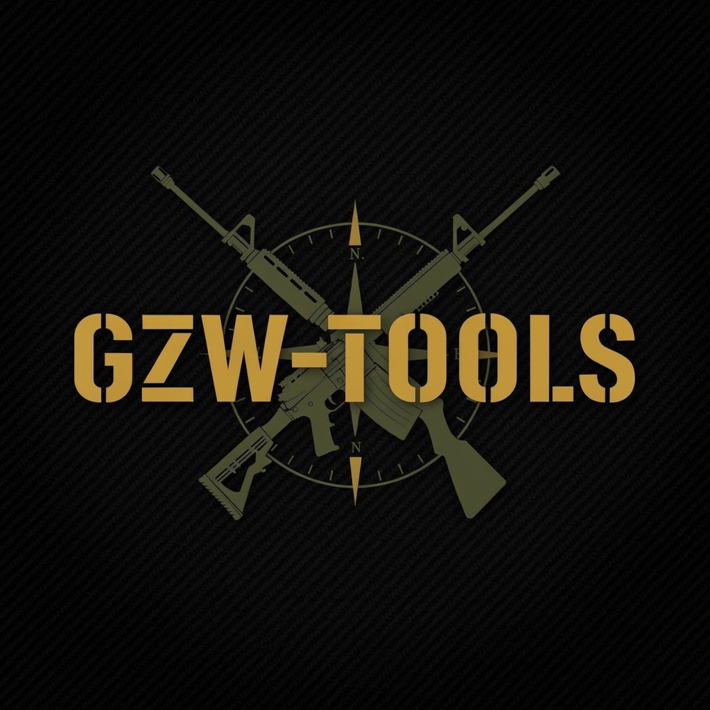

<picture>
  <source media="(prefers-color-scheme: dark)" srcset="public/logo.png">
  
</picture>

# ⚔️ GZW Tools

**Gray Zone Warfare** — Tools, reference, logs analyzer, and community API.

[](https://gzw-tools.vercel.app)
[](https://github.com/ZoniBoy00/gzw-tools)
[](https://gray-zone-warfare.fandom.com)

---

## 🎯 Features

### 📈 Reputation Calculator
- **Rep → $** — how much money to reach a vendor rep goal
- **$ → Rep** — how many rep points a dollar amount gets you
- **Vendor Quick Pick** — preset values per vendor
- **Real-time preview** — dual progress bar showing current vs target
- LocalStorage persistence — your values stay between sessions

### 🔫 Ammo Chart
- 70+ ammunition types across 13 calibers
- Penetration ratings against all 8 NIJ armor classes
- **Compare mode** — select 2-3 rounds side-by-side
- Color-coded penetration: green (penetrates), yellow (magdump), red (ineffective)
- **URL filters** — shareable links (`?caliber=5.56x45mm&asearch=AP`)
- Click any ammo for detailed modal with field tooltips

### 🔧 Weapons Database
- 44+ weapons with calibers, magazine sizes, fire rates, sources
- **Compare mode** — select 2-3 weapons side-by-side
- **Item detail modal** — click any weapon for full stats with tooltips
- **Wiki images** — thumbnails for weapons with wiki pages
- URL filters (`?wtype=Assault%20Rifle&wsearch=M4`)

### 🛡️ Armor & Gear Guide
- 16 armor vests with NIJ ratings, materials, weight
- 5 helmets with full specs
- **Compare mode** — compare vests/helmets side-by-side
- Tier-based recommendations (Budget → End Game)
- Vendor gear unlock tables
- **Detail modal** — click any item for full stats with tooltips

### 🏪 Vendor Guide
- **Per-vendor pages** — all 6 vendors with their item catalogues
- Items grouped by rep unlock level
- Live rep tracking with editable values
- Progress bars with percentage
- Vendor gear unlock reference table
- Thumbnails for items with wiki images

### 📋 Mission Finder
- 135+ missions from 6 vendors
- Search by name, vendor, area
- Filters: vendor, area, type
- Sort by name or vendor
- Expandable detail view with objectives
- Color-coded vendor indicators

### 🧱 Loadout Builder
- **Build Loadout** — create, save, edit, delete loadouts
  - Select weapons (searchable list)
  - Pick vest and helmet (dropdowns)
  - Choose ammunition
  - Add notes
  - All saved to LocalStorage
- **Smart Recommender** — guided loadout wizard
  - Step 1: Choose budget (Budget/Mid/High/End Game)
  - Step 2: Choose playstyle (Assault/Defense/Stealth)
  - Step 3: Get gear recommendation + suggested weapons + ammo

### 📊 Log Analyzer
- Paste or upload your `GZW.log` from `%localappdata%\GrayZoneWarfare\Saved\Logs\`
- Extracts: session duration, squad quests, server connections, player info, region, audio device, RAM usage
- **Performance metrics** — tick delays, frame drops, max latency
- **Log breakdown** — category-by-category bar chart (what fills your log)
- **Event timeline** — filterable by category, last 60 events
- 100% client-side — your log never leaves your browser

### 🌐 Custom API
- **9 endpoints**: `/api`, `/api/ammo`, `/api/vendors`, `/api/weapons`, `/api/armor`, `/api/armor/vests`, `/api/armor/helmets`, `/api/recommendations`, `/api/stats`, `/api/missions`, `/api/calculator/rep-to-dollars`, `/api/calculator/missions`, `/api/search`
- ETag caching with `stale-while-revalidate`
- CORS enabled — anyone can use it
- Unified response format with `meta` wrapper
- Rate limited: 100 req/min/IP

### 🤖 Wiki Scraper
- Fetches game data from GZW Fandom Wiki via MediaWiki API
- **Categories**: Weapons, Armor Vests, Helmets, Tactical Rigs, Backpacks, Magazines, Weapon Parts, Helmet Mods, Tasks, Contracts, Medical Items, Gear, Containers
- Extracts: infobox data, page images, tables from wikitable pages
- Outputs clean JSON files per category
- `python3 scripts/scraper/scrape.py --all`
- **GitHub Actions**: weekly auto-scrape, creates PR if data changed

---

## 🚀 Quick Start

```bash
# Clone & install
git clone https://github.com/ZoniBoy00/gzw-tools.git
cd gzw-tools
npm install

# Dev server
npm run dev

# Build
npm run build

# Deploy to Vercel
npx vercel --prod
```

### Run the scraper

```bash
cd scripts/scraper
pip install requests beautifulsoup4 lxml
python3 scrape.py --all
```

### Scraper options

```bash
python3 scrape.py --weapons      # Weapons only
python3 scrape.py --armor        # Armor vests, helmets, rigs
python3 scrape.py --ammo         # Ammunition data
python3 scrape.py --attachments  # Magazines, weapon parts, helmet mods
python3 scrape.py --tasks        # Missions and contracts
python3 scrape.py --other        # Medical, gear, containers
python3 scrape.py --all          # Everything (default)
```

---

## 🏗️ Project Structure

```
gzw-tools/
├── api/                        # Vercel serverless API (single index.js handler)
├── .github/workflows/
│   └── scrape.yml              # Weekly auto-scraper workflow
├── public/
│   ├── og-image.png            # Social preview (1200×630)
│   ├── robots.txt
│   ├── sitemap.xml
│   └── favicon-32.png
├── scripts/scraper/
│   ├── scrape.py               # Main scraper (v2 — comprehensive)
│   ├── wiki_parser.py          # MediaWiki API utilities
│   └── data/                   # Scraped JSON output
│       ├── weapons.json
│       ├── tasks.json
│       ├── vests.json / helmets.json / rigs.json
│       ├── magazines.json / weapon_parts.json
│       └── medical.json / gear.json / containers.json
├── src/
│   ├── components/
│   │   ├── ui/                 # Reusable UI primitives
│   │   │   ├── TabBar.tsx
│   │   │   └── ItemModal.tsx   # Unified detail modal with tooltips
│   │   ├── Dashboard.tsx       # Overview with editable vendor reps
│   │   ├── RepCalculator.tsx   # Rep → $ with real-time preview
│   │   ├── DollarCalculator.tsx
│   │   ├── MissionFinder.tsx   # 135+ mission browser
│   │   ├── AmmoGuide.tsx       # Ammo chart + compare
│   │   ├── WeaponsGuide.tsx    # Weapons browser + compare + modals
│   │   ├── ArmorGuide.tsx      # Armor/helmet browser + compare + modals
│   │   ├── VendorGuide.tsx     # Per-vendor item catalogues
│   │   ├── LoadoutBuilder.tsx  # Build + recommender wizard
│   │   ├── LogAnalyzer.tsx     # GZW.log parser & analyzer
│   │   └── ApiDocs.tsx         # Interactive API documentation
│   ├── data/
│   │   ├── weapons.ts / ammo/ / armor/  # Hardcoded datasets
│   │   ├── tasks.json           # Scraped missions (copied from scraper)
│   │   └── item_images.json     # Wiki thumbnail URLs
│   ├── lib/
│   │   ├── calc.ts              # Rep/mission calculator logic
│   │   ├── logparser.ts         # UE4 log parser
│   │   └── vendortracker.ts     # localStorage-backed vendor reps
│   └── App.tsx                  # 11-tab SPA layout
├── index.html
├── vercel.json
└── package.json
```

---

## 📊 Data Sources

| Source | Data | Method |
|--------|------|--------|
| [GZW Fandom Wiki](https://gray-zone-warfare.fandom.com) | Weapons, Armor, Tasks, Ammo, Attachments, Gear | MediaWiki API scraper (`scripts/scraper/`) |
| Manual curation | Ammo penetration tables, armor stats | Hand-maintained in `src/data/` |

---

## 🔗 API Endpoints

| Endpoint | Description |
|----------|-------------|
| `GET /api` | Root — API docs & version |
| `GET /api/ammo?caliber=` | Ammunition data, optional caliber filter |
| `GET /api/vendors` | All 6 vendors with rep values |
| `GET /api/weapons?type=&caliber=&search=` | Weapons with filters |
| `GET /api/armor` | All vests + helmets |
| `GET /api/armor/vests` | Vests only |
| `GET /api/armor/helmets` | Helmets only |
| `GET /api/recommendations` | Gear loadout tiers + vendor unlocks |
| `GET /api/missions?vendor=&area=&search=` | Mission database with filters |
| `GET /api/stats` | Aggregate counts & totals |
| `GET /api/calculator/rep-to-dollars?current=&target=&rate=` | Rep → $ calculation |
| `GET /api/calculator/missions?current=&target=` | Mission count calculation |
| `GET /api/search?q=` | Unified search across all datasets |

All endpoints return JSON.
Cache: `public, max-age=3600, stale-while-revalidate=86400`
CORS: Open to all origins.

---

## 📜 License

Community project — not affiliated with MADFINGER Games or M.A.G. Studios.

Built with React + TypeScript + Tailwind CSS + Vite. Powered by the Gray Zone Warfare Fandom Wiki.

**Gray Zone Warfare** © MADFINGER Games / M.A.G. Studios
